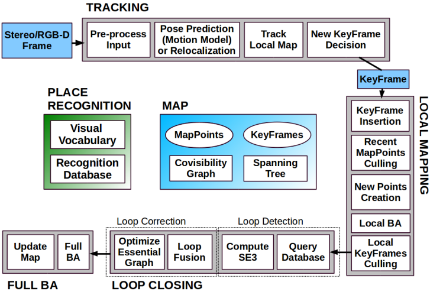
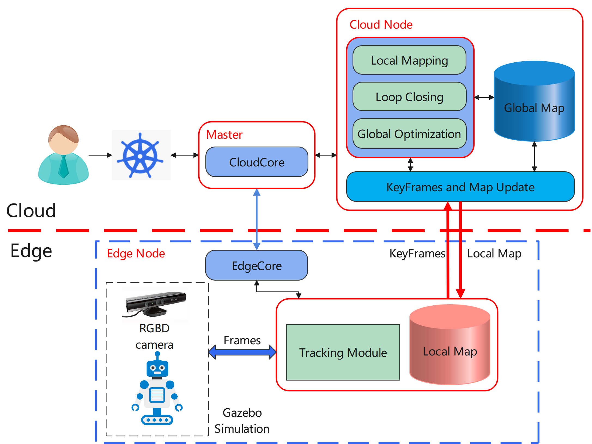
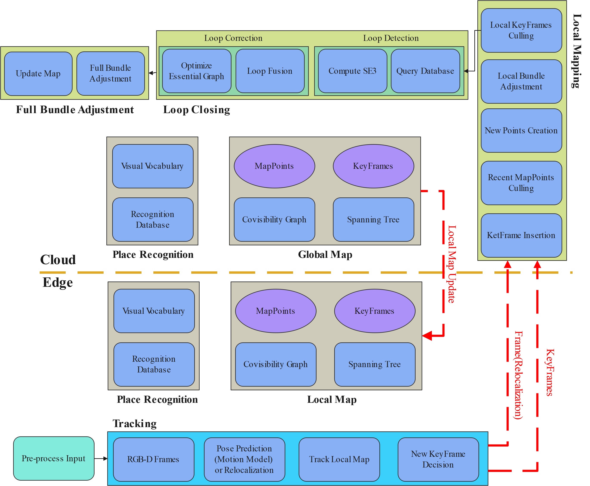

[toc]

## 1 Motivation

Currently, SLAM(simultaneous localization and mapping ) technology has been widely used in autonomous driving, mobile robots, VR/AR and other fields. However, in some resource-constrained scenarios, we want to offload computationally complex tasks with low real-time requirements to the cloud, such as global optimization, map construction, etc. Through this cloud-edge collaboration, tasks such as **long-term SLAM** and **crowd-sourced map construction** for edge-side devices are possible.

### 1.1 Goals

- The edge applications will be required to implement data collection and feature extraction in the simulation environment, send the data to cloud server for map creation.
- The edge applications will be required to keep track for a  moment when the network is disconnected.
- The cloud applications will be required to perform loop closing and global mapping tasks.

## 2 Proposal

We propose using one of the classic SLAM frameworks: ORB-SLAM2 as the basis. Just like ORB-SLAM2 or other classic frameworks, the SLAM system mainly includes four modules: tracking, local optimization, loop closure detection and global optimization. 

### 2.1 ORB-SLAM2 Overview

We use ORB-SLAM2 as a prototype since it is open source. So it is necessary to describe the framework of  ORB-SLAM2.

ORB-SLAM2 consists of three threads, one per module: tracking, local mapping, and loop closure as shown in above figure. The tracking thread loops through incoming image frames for their initial pose estimation and decides which frames to accept as a key-frame, based on five conditions:

1. If re-localization occurred, then 20 frames should pass to insert a new key-frame.
2. Either 20 frames have passed after the last inserted key-frame, or local mapping thread is not busy.
3. The current frame is tracking at least 50 features.
4. The current frame is tracking fewer than 90% points compared to the frame's reference key-frame
5. If the current frame tracks less than 100 close points, and can create more than 70 new close points.

### 2.2 Two Strategies

Typically, for real-time localization problem in an **unknown environment**, we have two strategies to achieve cloud-edge collaborative SLAM. they are:

* A complete **open-loop visual odometry system is deployed at the edge**, which generally includes two modules: tracking and local mapping. At the same time, loop closing and global optimization are deployed in the cloud to build a global map.
* Only the **tracking module is deployed at the edge**, the back-end optimization and loop closing tasks are completed in the cloud, and the cloud continuously pushes local maps to the edge.

The first strategy ensures that the edge has a long-term offline autonomy capability, but increases the computing and memory resource occupation of the edge. On the other hand, how to synchronize local map in the edge and global map in the cloud becomes a new problem.

The second method offloads all optimizations to the cloud, which greatly reduces the pressure on edge resources, but requires strong network stability. At the same time, the edge side only needs to maintain a small-scale local map (below 10 frames), and the local map can be updated easily by clearing local map on the edge and repalcing it with new received local map update from the cloud.

Based on the above discussion, based on the reliable network communication provided by kubeedge and edgemesh and some open source work available for reference(such as [edge-slam][https://github.com/droneslab/edgeslam]), we intend to use the second method for this work.

### 2.3 General Framework

The general framework is shown in the figure below. The cloud nodes are responsible for most of the operations, and the edge is responsible for data preprocessing, key frame selection, and pose tracking.

### 2.4 Use Cases

* Users can implement visual SLAM in simulation or real environments by providing ROS-based sensor data topics.

## 3 Design Details

### 3.1 Design Architecture

We will introduce the functions of each module in the form of sub-modules. The overall module design diagram is shown in the figure below. 

### 3.2 Tracking Module

Firstly, the edge part contains the Tracking module and the Local map module. The Tracking module performs data preprocessing and local tracking on the sensor data, and determines whether the current frame is a key frame. We use condition 3, 4 and 5 on the Tracking module and use 1, 2 on the cloud. We hope to achieve robust pose tracking while reduce communication usage by select less key-frames. 

If the tracking is loss, the algorithm will recovers pose through global re-localization. The current frame will be transfered to cloud and used to calculate the bag of words, query the recognition database for key-frame candidates.

### 3.3 Map Maintenance

In this work, we will use local map for tracking in the edge and maintain a global map in the cloud. 

**Global Map**

Global map is as same as the map in ORB-SLAM2, which contains the complete set of key-frames, set of map points, the covisibility graph and the essential graph.

**Local Map**

Local map is a subset of the global map, it contains several latest optimized key-frames and map points associated with.

**Map Synchronization**

To maintain the synchronization between local map and global map, the cloud      will send the latest subset of global map to edge frequently. If the update is **redundant** or **latency**, the edge will not use it.

## 4 Workers Communication

